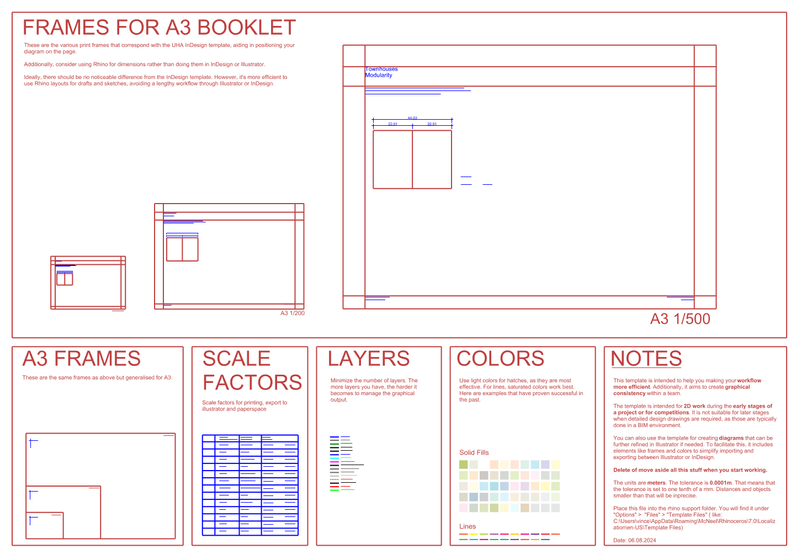
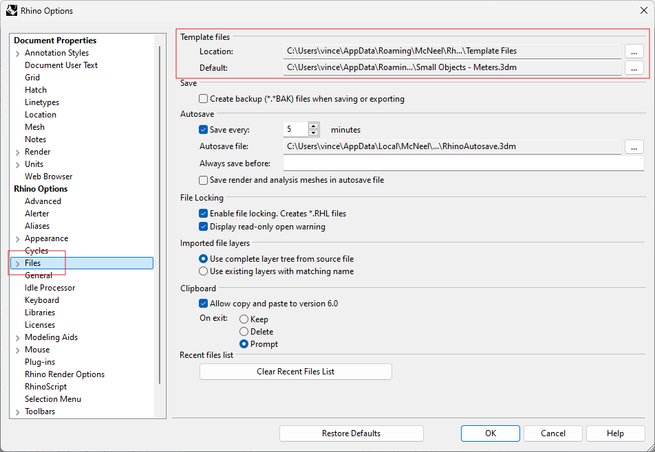

# 2D Rhino Template (Concept Design)

## How does it look like?

## What is it?
This file is designed to assist you in setting up a **2D Rhino file** for your architectural project. It's particularly useful in the **early stages** of a project, focusing on graphics and the creation of diagrams and plans.

The file includes a predefined set of layers, dimension and text styles, as well as A3 frames to make exporting to Illustrator easier. The table with scale factors is intended to help you set the correct scale

## And where shall i put it?

Save it in the folder with your template files. You can find the path here:

## Layers and naming convention for layers

The template includes a **simplified set of layers** that you can either use as is or expand upon. You can customize it to fit your specific needs. Generally, it's advisable to keep the number of layers to a minimum. The more layers you have, the harder it becomes to manage the graphics.

Over time, I've found that using a **naming convention** that groups layers is helpful. I typically name layers using a series of keywords that move from general to specific. For example: 

* Hatch Wall
* Lines Elevation Thin
* Lines Cut

## Colors

Rhino doesn’t make it too easy to find the right **colors**, but choosing the correct ones can greatly influence your graphics. The first decision to make is the background color:

* **white background** is ideal for graphics with fine details, as it allows lines to print more clearly.

* a **black background**, on the other hand, can make elements glow and stand out, though physical prints can be more difficult to control. Thin lines often get lost in the dark ink.

The colors in the template are optimized for white backgrounds. A useful tip is to keep fills as light as possible while using more pronounced colors for lines. The swatches in the file are well-suited for site plans, area plans, and similar graphics.
